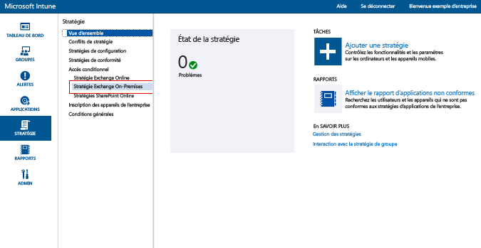
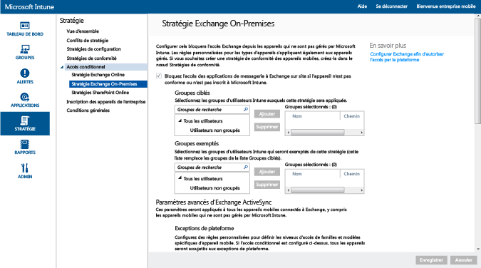

# Restreindre l’accès à la messagerie Exchange sur site et Exchange Online Dedicated (environnement hérité) avec Intune

Si vous disposez d’un environnement Exchange Online Dedicated et que vous ne savez pas s’il s’agit de la nouvelle configuration ou d’une configuration héritée, contactez votre responsable de compte.

Pour contrôler l’accès à la messagerie Exchange sur site ou Exchange Online Dedicated (environnement hérité), configurez l’accès conditionnel à Exchange sur site dans Intune.
Pour en savoir plus sur le fonctionnement de l’accès conditionnel, lisez l’article [Restreindre l’accès à la messagerie et aux services O365]( restrict-access-to-email-and-o365-services-with-microsoft-intune.md).

**Avant** de configurer l’accès conditionnel, vérifiez les éléments suivants :

-   Votre version d’Exchange doit être **Exchange 2010 ou une version ultérieure**. Le groupe de serveurs d’accès au client (CAS) du serveur Exchange est pris en charge.

-   Vous devez utiliser le **connecteur Exchange local** qui connecte [!INCLUDE[wit_nextref](../includes/wit_nextref_md.md)] à Microsoft Exchange sur site. Ceci vous permet de gérer les appareils avec la console [!INCLUDE[wit_nextref](../includes/wit_nextref_md.md)]. Pour plus d’informations sur le connecteur, consultez [Connecteur Exchange sur site Intune](intune-on-premises-exchange-connector.md).

    -   Le connecteur Exchange local auquel vous avez accès dans la console Intune est propre à votre client Intune et ne peut pas être utilisé avec un autre client. Vous devez également vous assurer que le connecteur Exchange de votre client est installé **sur un seul ordinateur**.

        Ce connecteur doit être téléchargé à partir de la console d’administration Intune.  Pour consulter une procédure pas à pas permettant de configurer le connecteur Exchange sur site, consultez [Configurer le connecteur Exchange sur site pour Exchange sur site ou hébergé](intune-on-premises-exchange-connector.md).

    -   Vous pouvez installer le connecteur sur n’importe quel ordinateur, tant que celui-ci peut communiquer avec le serveur Exchange.

    -   Le connecteur prend en charge l’**Environnement CAS Exchange**. Techniquement, vous pouvez installer directement le connecteur sur le serveur CAS Exchange si vous le souhaitez, mais cette opération est déconseillée car elle augmente la charge sur le serveur.
    Quand vous configurez le connecteur, vous devez faire en sorte qu’il communique avec l’un des serveurs CAS Exchange.

-   Vous devez configurer **Exchange ActiveSync** avec l’authentification par certificat ou la saisie des informations d’identification de l’utilisateur.

Une fois les stratégies d’accès conditionnel configurées et ciblées sur un utilisateur, l’**appareil** dont l’utilisateur se sert pour se connecter à sa messagerie doit :

-  Être **inscrit** auprès d’[!INCLUDE[wit_nextref](../includes/wit_nextref_md.md)] ou être un PC joint à un domaine.

-  Être **inscrit dans Azure Active Directory**. En outre, l’ID Exchange ActiveSync du client doit être inscrit auprès d’Azure Active Directory.

  Le service AAD DRS sera activé automatiquement pour les clients Intune et Office 365. Les clients qui ont déjà déployé le service d'inscription d'appareils AD FS ne verront pas les appareils inscrits dans leur annuaire Active Directory local. **Cela ne s’applique pas aux PC Windows ni aux appareils Windows Phone**.

-   Être **conforme** à toutes les stratégies de conformité [!INCLUDE[wit_nextref](../includes/wit_nextref_md.md)] déployées sur cet appareil.

Le diagramme suivant illustre le flux utilisé par les stratégies d’accès conditionnel d’Exchange sur site pour déterminer s’il faut autoriser ou bloquer des appareils.

 Si une stratégie d’accès conditionnel n’est pas remplie, l’utilisateur reçoit l’un des messages suivants quand il se connecte :

- Si l’appareil n’est pas inscrit auprès d’[!INCLUDE[wit_nextref](../includes/wit_nextref_md.md)] ou qu’il n’est pas inscrit dans Azure Active Directory, l’utilisateur reçoit un message contenant des instructions pour installer l’application du portail d’entreprise, inscrire l’appareil et activer la messagerie. Ce processus associe également l’ID Exchange ActiveSync de l’appareil à l’enregistrement de l’appareil dans Azure Active Directory.

-   Si l’appareil n’est pas conforme, l’utilisateur reçoit un message le dirigeant vers l’application ou le site web du portail d’entreprise [!INCLUDE[wit_nextref](../includes/wit_nextref_md.md)], où il peut trouver des informations sur le problème et des solutions pour y remédier.

## Prise en charge des appareils mobiles
-   Windows Phone 8.1 et versions ultérieures

-   Application de messagerie native sur iOS.

-   Clients de messagerie EAS, comme Gmail sur Android 4 ou ultérieur.
- Clients de messagerie EAS sur les **appareils Android for Work :** seules les applications **Gmail** et **Nine Work** dans le **profil professionnel** sont prises en charge sur les appareils Android for Work. Pour que l’accès conditionnel fonctionne avec Android for Work, vous devez déployer un profil de messagerie pour l’application Gmail ou Nine Work et également déployer ces applications comme installation obligatoire. 

[!INCLUDE[wit_nextref](../includes/afw_rollout_disclaimer.md)]

> [!NOTE]
> L’application Microsoft Outlook pour Android et iOS n’est pas prise en charge.

## Prise en charge des PC

Application **Courrier** sur Windows 8.1 et versions ultérieures (en cas d’inscription avec [!INCLUDE[wit_nextref](../includes/wit_nextref_md.md)])

##  Configurer une stratégie d’accès conditionnel

1.  Dans la [console d’administration Microsoft Intune](https://manage.microsoft.com), choisissez **Stratégie** > **Accès conditionnel** > **Stratégie Exchange sur site**.

2.  Configurez la stratégie avec les paramètres nécessaires : 

  - **Empêcher les applications de messagerie d’accéder à Exchange sur site si l’appareil n’est pas conforme ou n’est pas inscrit à Microsoft Intune :** lorsque vous sélectionnez cette option, les appareils qui ne sont pas gérés par [!INCLUDE[wit_nextref](../includes/wit_nextref_md.md)] ou qui ne sont pas conformes à une stratégie de conformité n’ont pas accès aux services Exchange.

  - **Substitution de règle par défaut - Toujours autoriser les appareils inscrits et conformes pour l’accès à Exchange : ** Quand vous activez cette option, les appareils inscrits dans Intune et conformes aux stratégies de conformité sont autorisés à accéder à Exchange.  
  Cette règle se substitue à la **Règle par défaut**, ce qui signifie que même si vous définissez la mise en quarantaine ou un blocage de l’accès par le biais de la **Règle par défaut**, les appareils inscrits et conformes peuvent toujours accéder à Exchange.

  - **Groupes ciblés :** Sélectionnez les groupes d’utilisateurs [!INCLUDE[wit_nextref](../includes/wit_nextref_md.md)] qui doivent inscrire leurs appareils auprès d’[!INCLUDE[wit_nextref](../includes/wit_nextref_md.md)] pour pouvoir accéder à Exchange.

  - **Groupes exemptés :** Sélectionnez les groupes d’utilisateurs [!INCLUDE[wit_nextref](../includes/wit_nextref_md.md)] qui sont exempts de la stratégie d’accès conditionnel. Les utilisateurs de cette liste seront exemptés même s’ils se trouvent également dans la liste **Groupes ciblés**.

  - **Exceptions de plateforme :** Choisissez **Ajouter une règle** pour configurer une règle qui définit des niveaux d’accès pour les familles et modèles d’appareils mobiles spécifiés. Étant donné que ces appareils peuvent être de n’importe quel type, vous pouvez également configurer des types d’appareils non pris en charge par [!INCLUDE[wit_nextref](../includes/wit_nextref_md.md)].

  - **Règle par défaut :** Si vous avez un appareil qui n’est pas couvert par d’autres règles, vous pouvez choisir de l’autoriser à accéder à Exchange, de le bloquer ou de le mettre en quarantaine. Quand vous définissez la règle de façon à autoriser l’accès aux appareils inscrits et conformes, l’accès à la messagerie est accordé automatiquement aux appareils iOS, Windows et Samsung KNOX. L’utilisateur final n’a pas besoin de suivre un processus quelconque pour accéder à sa messagerie électronique.  Sur les appareils Android qui n’exécutent pas Samsung KNOX, les utilisateurs finaux obtiennent un message électronique de mise en quarantaine comprenant une procédure pas à pas guidée qu’ils doivent suivre pour vérifier l’inscription et la conformité avant de pouvoir accéder à la messagerie. Si vous définissez la règle de blocage d’accès ou de mise en quarantaine, aucun appareil ne peut accéder à Exchange, qu’il soit ou non déjà inscrit dans Intune. Pour éviter que les appareils inscrits et conformes soient affectés par cette règle, cochez la case **Substitution de règle par défaut**.
>[!TIP]
>Si vous avez l’intention de bloquer au préalable tous les appareils avant de leur accorder l’accès à la messagerie électronique, choisissez la règle de blocage d’accès ou de mise en quarantaine. La règle par défaut s’applique à tous les types d’appareils. Ainsi, les types d’appareils que vous configurez en tant qu’exceptions de plateforme et qui ne sont pas pris en charge par [!INCLUDE[wit_nextref](../includes/wit_nextref_md.md)] sont également affectés.

  - **Notification utilisateur :** En plus du message électronique de notification envoyé par Exchange, Intune envoie un message électronique configurable qui contient les étapes à suivre pour débloquer l’appareil. Vous pouvez modifier le message par défaut pour le personnaliser selon vos besoins. Le message électronique de notification Intune contenant les instructions de correction est envoyé dans la boîte aux lettres Exchange de l’utilisateur. Par conséquent, si l’appareil de l’utilisateur est bloqué avant de recevoir le courrier électronique, l’utilisateur peut utiliser un appareil non bloqué ou recourir à une autre méthode pour accéder à Exchange et afficher le message. Cela est particulièrement vrai quand le blocage ou la mise en quarantaine est défini avec la **Règle par défaut**.  Dans ce cas, l’utilisateur final doit accéder à son magasin d’applications, télécharger l’application du portail d’entreprise Microsoft et inscrire son appareil. Cela s’applique aux appareils iOS, Windows et Samsung KNOX.  Pour les appareils qui n’exécutent pas Samsung KNOX, l’administrateur informatique doit envoyer le message électronique de mise en quarantaine à un autre compte de messagerie, que l’utilisateur final doit ensuite copier sur son appareil bloqué pour finaliser l’inscription et la mise en conformité.
  > [!NOTE]
  > Pour que le message électronique de notification puisse être envoyé par Exchange, vous devez spécifier le compte à utiliser pour l’envoyer.
  >
  > Pour plus d’informations, consultez [Configurer le connecteur Exchange sur site pour Exchange sur site ou hébergé](intune-on-premises-exchange-connector.md).

3.  Une fois terminé, choisissez **Enregistrer**.

-   La stratégie d'accès conditionnel prend effet immédiatement. Il est donc inutile de la déployer.

-   Une fois qu'un utilisateur a configuré un profil Exchange ActiveSync, le blocage de son appareil peut prendre entre une et trois heures (s'il n'est pas géré par [!INCLUDE[wit_nextref](../includes/wit_nextref_md.md)]).

-   Si un utilisateur bloqué inscrit alors l’appareil auprès d’[!INCLUDE[wit_nextref](../includes/wit_nextref_md.md)] et corrige la non-conformité, l’accès à la messagerie électronique est débloqué dans les deux minutes.

-   Si l'utilisateur annule l'inscription auprès de [!INCLUDE[wit_nextref](../includes/wit_nextref_md.md)], le blocage de son appareil peut prendre entre une et trois heures.

**Pour obtenir des exemples de scénarios décrivant comment configurer la stratégie d’accès conditionnel pour restreindre l’accès des appareils, consultez des [exemples de scénarios de restriction de l’accès à la messagerie](restrict-email-access-example-scenarios.md).**

## Étapes suivantes
[Restreindre l’accès à SharePoint Online](restrict-access-to-sharepoint-online-with-microsoft-intune.md)

[Restreindre l’accès à Skype Entreprise Online](restrict-access-to-skype-for-business-online-with-microsoft-intune.md)

<!--HONumber=Dec16_HO2-->

