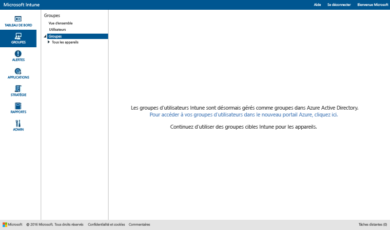
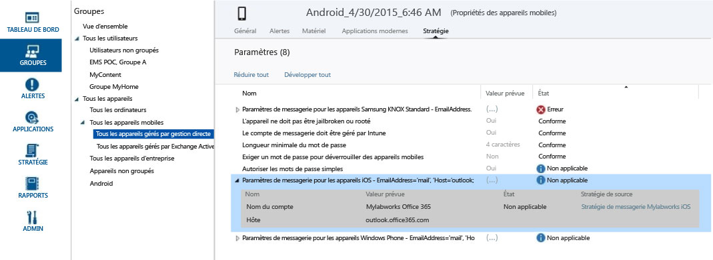

# Utiliser des groupes pour gérer les utilisateurs et les appareils dans Microsoft Intune

Cette rubrique explique comment créer des groupes dans Intune. Elle fournit également des informations sur l’évolution de la gestion des groupes dans mois à venir. 

>[!IMPORTANT]
>
>Si vous ouvrez l’espace de travail Groupes dans le portail Intune et que vous voyez un lien vers le portail Azure Active Directory (Azure AD), cela signifie que vous utilisez déjà la *nouvelle* approche des groupes de sécurité Azure AD pour gérer les groupes dans Intune, comme cela est décrit dans [Note concernant les prochaines améliorations apportées à l’expérience d’administration pour les groupes](#notice-of-upcoming-improvements-to-the-admin-experience-for-groups). Cliquez sur le lien vers le portail Azure AD pour créer et gérer vos groupes.
>
> 
>
>Si vous ne voyez pas le lien vers le portail Azure AD, cela indique que vous utilisez encore l’approche *actuelle* pour gérer les groupes, tel que décrit dans la section [Créer des groupes pour gérer les utilisateurs et les appareils avec Microsoft Intune](#Create-groups-to-manage-users-and-devices-with-Microsoft-Intune) de cette rubrique.

## Note concernant les prochaines améliorations apportées à l’expérience d’administration pour les groupes

Vous avez exprimé le souhait d’avoir une expérience de regroupement et de ciblage unique dans Enterprise Mobility + Security. Nous avons donc décidé de convertir prochainement les groupes Intune en groupes de sécurité Azure Active Directory. Cette modification permettra d’unifier la gestion des groupes entre Intune et Azure Active Directory (Azure AD). La nouvelle expérience vous évitera d’avoir à dupliquer les groupes entre les services. Elle vous permettra aussi d’utiliser Windows PowerShell et Microsoft Graph pour améliorer l’extensibilité.

### Comment cela m’affecte-t-il aujourd’hui ?
Si vous êtes déjà client Intune, cette modification n’a pas d’incidence pour vous aujourd’hui, mais nous pouvons vous indiquer les nouveautés à venir :

-   Les nouveaux comptes utiliseront des groupes de sécurité Azure AD au lieu de groupes d’*utilisateurs* Intune.   
-   À partir de novembre 2016, les nouveaux comptes qui sont approvisionnés après la mise à jour Service Release mensuelle gèreront les groupes d’utilisateurs et les groupes d’appareils ensemble dans le portail Azure AD. Il n’y aura pas d’impact pour les clients existants.
-   En décembre 2016, l’équipe produit Intune commencera la migration des clients actuels vers la nouvelle expérience de gestion de groupes Azure AD. Tous les groupes d’utilisateurs et d’appareils figurant déjà dans Intune seront migrés vers des groupes de sécurité Azure AD. Nous ne démarrerons pas la migration tant que nous ne serons pas sûrs de pouvoir minimiser l’impact sur votre travail quotidien et garantir qu’il n’y aura aucun impact sur les utilisateurs. Par ailleurs, nous vous avertirons avant d’effectuer la migration de votre compte.

### Quand et comment serai-je migré vers la nouvelle expérience de groupes ?
Nous allons effectuer la migration des clients Intune actuels sur une période donnée. Actuellement, nous finalisons la planification de cette migration et nous prévoyons de mettre à jour cette rubrique dans les semaines à venir pour vous donner plus de détails. Nous vous avertirons avant de commencer la migration. Si vous avez des questions concernant la migration, contactez notre équipe de migration à l’adresse [intunegrps@microsoft.com](mailto:intunegrps@microsoft.com). Pour plus d’informations sur la façon dont les groupes seront migrés, consultez [Migration des groupes vers Azure Active Directory](migrating-groups-to-azure-active-directory.md).

### Qu’arrivera-t-il à mes groupes d’utilisateurs et d’appareils existants ?
 Les groupes d’utilisateurs et d’appareils que vous avez créés dans Intune seront migrés vers des groupes de sécurité Azure AD. Les groupes Intune par défaut, comme le groupe Tous les utilisateurs, seront migrés uniquement s’ils sont utilisés dans des déploiements au moment de la migration. Il est possible que la migration soit plus complexe pour certains groupes. Nous vous avertirons si des étapes supplémentaires sont nécessaires pour la migration dans votre organisation.

### Quelles seront les nouvelles fonctionnalités à ma disposition ?
Voici les nouvelles fonctionnalités que nous allons introduire dans le cadre de la migration d’Intune vers Azure Active Directory :

-    Les groupes de sécurité Azure AD seront pris en charge dans Intune pour tous les types de déploiements.
-    Les groupes de sécurité Azure AD prendront en charge le regroupement d’appareils et d’utilisateurs.
-    Les groupes de sécurité Azure AD prendront en charge les groupes dynamiques qui ont des attributs d’appareils Intune. Par exemple, vous pourrez regrouper des appareils de manière dynamique en fonction de la plateforme (comme iOS). Quand un nouvel appareil iOS sera inscrit dans votre organisation, il sera automatiquement ajouté au groupe dynamique d’appareils iOS.
-    Vous bénéficierez ainsi d’une expérience d’administration partagée pour la gestion des groupes Azure AD et Intune.
- Le rôle Administrateur de service Intune sera ajouté à Azure AD pour permettre aux administrateurs de services Intune d’effectuer des tâches de gestion de groupes dans Azure AD.

### Quelles seront les fonctionnalités Intune qui ne seront pas disponibles ?
Malgré l’amélioration de l’expérience de groupe, certaines fonctionnalités Intune ne seront pas disponibles après la migration des groupes Intune vers des groupes de sécurité Azure AD dans votre organisation.

#### Fonctionnalité de gestion de groupe

-   Après la migration, vous ne pourrez pas exclure des membres ou des groupes quand vous créez un groupe. Toutefois, avec les groupes dynamiques Azure AD, vous pourrez utiliser des attributs pour créer des règles avancées vous permettant d’exclure certains membres d’un groupe en fonction des critères de votre choix.
-   Les groupes Utilisateurs non groupés et Appareils non groupés ne seront pas pris en charge. Nous n’effectuerons pas leur migration d’Intune vers Azure AD.

#### Fonctionnalités de groupe

-   Le rôle Administrateur de service n’aura pas les autorisations **Gérer les groupes**.
-   Vous ne pourrez pas regrouper d’appareils Exchange ActiveSync. Votre groupe Tous les appareils gérés par EAS sera converti en affichage de rapport.
-  Le glissement des groupes dans les rapports ne sera pas disponible.
-  Le ciblage de groupe personnalisé des règles de notification ne sera pas disponible.

### Que dois-je faire pour me préparer à cette modification ?
 Voici quelques recommandations qui vous aideront à effectuer cette transition :

- Nettoyez les groupes Intune dont vous n’avez plus besoin avant la migration.
- Évaluez votre utilisation de l’exclusion dans les groupes et modifiez la conception de vos groupes pour ne plus avoir besoin d’utiliser d’exclusion.
-  Si certains de vos administrateurs n’ont pas l’autorisation de créer des groupes dans Azure AD, demandez à votre administrateur Azure AD de les ajouter au rôle Azure AD Administrateur de service Intune.

## Créer des groupes pour gérer les utilisateurs et les appareils avec Microsoft Intune

Cette section décrit comment créer des groupes Intune dans la console d’administration Intune.

Vous pouvez créer et gérer des groupes dans l’espace de travail **Groupes** dans la console d’administration Microsoft Intune. La page **Vue d’ensemble des groupes** affiche des synthèses d’état qui peuvent vous aider à identifier et hiérarchiser les problèmes à examiner. Les synthèses d’état couvrent ces domaines :

-   Alertes
-   Mises à jour logicielles
-   Endpoint Protection
-   Stratégie
-   Gestion des logiciels

Votre hiérarchie de groupes affiche également des synthèses d’état pour vous aider à identifier et résoudre les problèmes rencontrés avec des membres d’un groupe sélectionné.

## Créer des groupes

> [!TIP]
> Quand vous créez des groupes, tenez compte de la façon dont vous allez appliquer les stratégies. Par exemple, vous pouvez avoir des stratégies propres au système d’exploitation d’un appareil, ainsi que des stratégies spécifiques pour les différents rôles définis dans votre organisation ou pour les unités d’organisation que vous avez déjà définies dans Active Directory. Il peut être utile de créer des groupes d’appareils distincts pour iOS, Android et Windows, et un groupe d'utilisateurs pour chaque rôle organisationnel.
>
> Vous souhaiterez sans doute aussi créer une stratégie par défaut applicable à tous les groupes et appareils pour établir les exigences de base de votre organisation en matière de conformité. Ensuite, vous pouvez créer des stratégies particulières pour les catégories d’utilisateurs et d’appareils les plus générales, par exemple des stratégies de messagerie pour chaque système d’exploitation des appareils.
>
> Veillez à affecter des noms explicites à vos stratégies pour pouvoir facilement les identifier par la suite. Voici un exemple de nom de stratégie descriptif : **Stratégie de messagerie WP pour toute l’entreprise**.
>
> Communiquez chaque nouvelle stratégie restrictive à vos utilisateurs. Après avoir créé les groupes et stratégies d’ordre général, créez des groupes de plus petite taille, avec l’objectif de réduire les communications inutiles.

### Pour créer un groupe d'appareils

1.  Dans la console d’administration Intune, choisissez **Groupes** &gt; **Vue d’ensemble** &gt; **Créer un groupe**.

2.  Entrez un nom et une description (facultative) pour le groupe, puis sélectionnez un groupe d’appareils en tant que groupe parent. Choisissez **Suivant**.

3.  Dans la page **Définir les critères d’appartenance**, sélectionnez le type des appareils à inclure dans le groupe. Selon le type d’appareil que vous choisissez d’inclure, d’autres options de configuration de groupe vous sont proposées :

    -   **Ordinateur**. Choisissez si vous souhaitez inclure tous les membres du groupe parent, et sélectionnez les unités d’organisation et les domaines à inclure ou exclure. Vous pouvez obtenir les informations sur les unités d’organisation et les domaines d’un ordinateur à partir de l’inventaire.

    -   **Mobile**. Choisissez si vous souhaitez inclure les appareils mobiles gérés par Intune ou ceux gérés par Exchange ActiveSync, ou l’ensemble de ces appareils.

    -   **Tous les appareils**. Choisissez cette option pour inclure tous les appareils, sans exclusions basées sur des critères.

4.  Dans la page **Définir l’appartenance directe**, choisissez **Parcourir** pour sélectionner individuellement les appareils à inclure ou exclure. Si vous sélectionnez des appareils qui ne sont pas dans le groupe parent que vous avez spécifié, Intune ajoute automatiquement ces appareils au groupe parent.

5.  Dans la page **Résumé**, vérifiez vos sélections, puis choisissez **Terminer**.

Le nouveau groupe s’affiche dans la liste **Groupes**, dans l’espace de travail **Groupes**, sous le groupe parent. C’est aussi à cet emplacement que vous pouvez modifier ou supprimer le groupe.

### Pour créer un groupe d'utilisateurs

1.  Dans la console d’administration Intune, choisissez **Groupes** &gt; **Vue d’ensemble** &gt; **Créer un groupe**.

2.  Entrez un nom et une description (facultative) pour le groupe, puis sélectionnez un groupe d’utilisateurs en tant que groupe parent. Choisissez **Suivant**.

3.  Dans la page **Définir les critères d’appartenance**, choisissez si vous voulez inclure tous les membres du groupe parent ou démarrer avec un groupe vide. Ensuite, choisissez d’inclure ou d’exclure des membres en fonction des groupes de sécurité d’utilisateurs que vous configurez manuellement dans le [Centre d’administration Office 365](http://go.microsoft.com/fwlink/?LinkId=698854) ou que vous synchronisez à partir d’Active Directory. Si l’appartenance à un groupe de sécurité change, l’appartenance des groupes d’utilisateurs dépendants de ce groupe de sécurité change également.

    > [!IMPORTANT]
    > Actuellement, si votre groupe inclut des membres de groupes de sécurité ou de groupes de responsables spécifiques et que vous excluez des membres de certains groupes, les membres que vous avez inclus au départ sont supprimés. Pour créer un groupe contenant des membres inclus et des membres exclus, nous vous recommandons de créer d’abord un groupe parent avec les membres inclus, puis de créer un groupe enfant dans lequel vous ajoutez les membres exclus. Utilisez ensuite ce groupe enfant pour gérer les stratégies, les profils et la distribution d’applications Intune.

    > [!NOTE]
    > Dans le portail Azure, vous pouvez créer des groupes en fonction des responsables des utilisateurs. Il s’agit de groupes dynamiques, dont le contenu change à mesure que des employés sont ajoutés ou supprimés dans l’équipe d’un responsable dans Azure Active Directory. Pour savoir comment créer un groupe Azure basé sur un nom de responsable, consultez [Utilisation d’attributs pour créer des règles avancées](https://azure.microsoft.com/en-us/documentation/articles/active-directory-accessmanagement-groups-with-advanced-rules/), à la section **Pour configurer un groupe en tant que groupe « Responsable »**.

4.  Dans la page **Définir l’appartenance directe**, choisissez **Parcourir** pour sélectionner individuellement les utilisateurs à inclure ou exclure. Si vous sélectionnez des utilisateurs qui ne sont pas dans le groupe parent que vous avez spécifié, Intune ajoute automatiquement ces utilisateurs au groupe parent. L’option permettant d’ajouter manuellement un utilisateur se trouve en bas de la boîte de dialogue **Sélectionner les membres**. Cela est utile si vous souhaitez ajouter un utilisateur qui ne dispose pas encore d’un appareil inscrit.

5.  Dans la page **Résumé**, vérifiez vos sélections, puis choisissez **Terminer**.

Le nouveau groupe s’affiche dans la liste **Groupes**, dans l’espace de travail **Groupes**, sous le groupe parent. C’est aussi à cet emplacement que vous pouvez modifier ou supprimer le groupe.

> [!TIP]
> Les groupes de sécurité constituent un bon point de départ pour remplir les groupes d’utilisateurs. Étant donné que les groupes de sécurité définissent qui a accès aux différentes ressources, leur conversion en groupes d’utilisateurs Intune ne pose aucun problème. Quand vous créez des groupes d’utilisateurs dans Intune, vous pouvez utiliser les groupes de sécurité qui sont synchronisés entre Active Directory et Azure Active Directory, ou ceux que vous créez directement dans Azure Active Directory par le biais du Centre d’administration Office 365 ou du portail Azure.

## Filtrer les vues de l’administrateur par rôle
Avec les vues de groupes filtrées, vous pouvez personnaliser le contenu qui s’affiche aux administrateurs informatiques en fonction de leur rôle, et restreindre les groupes que chaque administrateur informatique peut gérer. Ces vues peuvent être utiles dans les cas suivants :

-   Vous souhaitez que vos administrateurs informatiques puissent déployer des éléments uniquement pour des utilisateurs et appareils spécifiques.
-   Vous souhaitez afficher aux administrateurs informatiques uniquement les groupes qui les intéressent.

Vous pouvez configurer des vues de groupes filtrées pour les administrateurs de service dans la console d’administration Intune. Pour plus d’informations, consultez [Informations à connaître avant de commencer à utiliser Microsoft Intune](/intune/get-started/what-to-know-before-you-start-microsoft-intune).

Une fois que vous avez configuré des vues de groupes filtrées pour un administrateur de service, cet administrateur peut uniquement afficher et sélectionner les groupes que vous avez spécifiés quand il déploie des logiciels ou des stratégies, ou génère des rapports. De plus, l’administrateur ne voit pas les informations d’état dans les pages suivantes de la console d’administration :

-   **Présentation du système**
-   **Vue d’ensemble des groupes**
-   **Vue d’ensemble de Endpoint Protection**
-   **Vue d’ensemble des alertes**
-   **Vue d’ensemble du logiciel**
-   **Vue d’ensemble de la stratégie**

### Pour créer une vue de groupes filtrée

1.  Dans la console d’administration Intune, choisissez **Administration** &gt; **Gestion des administrateurs** &gt; **Administrateurs de service**.

2.  Sélectionnez l’administrateur de service pour lequel vous souhaitez créer une vue de groupes filtrée, puis choisissez **Gérer les groupes**.

3.  Dans la boîte de dialogue **Sélectionner les groupes qui seront visibles pour cet administrateur de service**, ajoutez les groupes que l’administrateur de service pourra voir, puis choisissez **OK**.

Une fois que les vues de groupes filtrées ont été configurées, l’administrateur informatique peut uniquement afficher et sélectionner les groupes que vous avez sélectionnés.

## Gérer vos groupes
Une fois vos groupes créés, vous pouvez les gérer en fonction des besoins de votre organisation.

Vous pouvez modifier un groupe, notamment son nom, sa description et ses membres.

Vous pouvez supprimer un groupe qui ne répond plus aux besoins de votre organisation. Le fait de supprimer un groupe ne supprime pas les utilisateurs appartenant à ce groupe.

## Étapes suivantes
Après avoir configuré vos groupes et stratégies, vérifiez les paramètres **Valeur prévue** et **État** pour voir les implications pratiques de votre conception.

### Pour vérifier votre conception

1. Sélectionnez un appareil dans un groupe d’appareils et examinez les catégories d’informations en haut de la page.
2. Choisissez **Stratégie**. Voici une capture d'écran des paramètres de stratégie d'un appareil Android qui illustre les informations affichées à l'écran.

Chaque stratégie contient une **Valeur prévue** et un **État**. La valeur prévue est la valeur que vous prévoyez d’obtenir quand vous affectez la stratégie. L’état est le résultat obtenu final, quand toutes les stratégies qui s’appliquent à l’appareil ainsi que les restrictions et les exigences du matériel et du système d’exploitation sont prises en compte. Cette capture d’écran illustre clairement ce point à travers deux exemples :

-   **Autoriser les mots de passe simples** est défini avec la valeur **Oui**, comme indiqué dans la colonne **Valeur prévue**, mais son **État** a la valeur **Non applicable**. Cela est dû au fait que les mots de passe simples ne sont pas pris en charge par les appareils Android.
-   De même, l’élément de stratégie développé **Paramètres de messagerie pour les appareils iOS** n’est pas appliqué à cet appareil, car il s’agit d’un appareil Android.

> [!NOTE]
> N’oubliez pas que quand deux stratégies avec différents niveaux de restriction s’appliquent au même appareil ou utilisateur, la stratégie la plus restrictive prévaut dans la pratique.

<!--HONumber=Nov16_HO1-->

