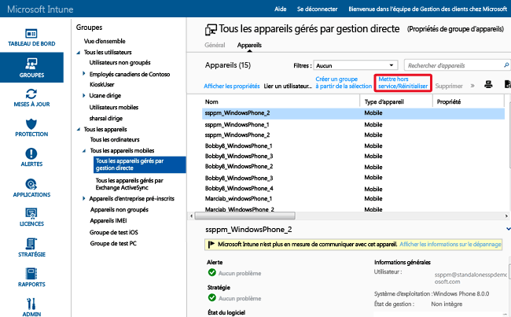

# Protégez vos données avec la réinitialisation complète ou sélective à l’aide de Microsoft Intune
Vous pouvez réinitialiser les applications et les données à partir d’appareils gérés par Intune qui ne sont plus nécessaires, qui ont été réaffectés ou ont disparu. Pour ce faire, Intune propose des fonctionnalités de réinitialisation sélective et de réinitialisation complète. Les utilisateurs peuvent également émettre une commande de réinitialisation d’appareil à distance à partir de l’application Portail d’entreprise Intune sur les appareils privés inscrits dans Intune.

  > [!NOTE]
  > Cette rubrique concerne uniquement la réinitialisation d’appareils gérés à l’aide de la gestion des appareils mobiles Intune. Vous pouvez aussi utiliser le [portail Azure](https://portal.azure.com) pour [réinitialiser les données d’entreprise des applications](wipe-managed-company-app-data-with-microsoft-intune.md). Vous pouvez également [mettre hors service des ordinateurs gérés à l’aide du logiciel client Intune](retire-a-windows-pc-with-microsoft-intune.md).

## réinitialisation complète

**Une réinitialisation complète** rétablit les paramètres d’usine d’un appareil et supprime l’ensemble des données et des paramètres de l’entreprise et de l’utilisateur. L’appareil est supprimé d’Intune. La réinitialisation complète est utile pour réinitialiser un appareil avant de le transmettre à un nouvel utilisateur ou dans les cas où l’appareil a été perdu ou volé.  **Faites attention lors de la sélection de la réinitialisation complète. Les données sur l’appareil ne peuvent pas être récupérées**.

> [!Warning]
> Les appareils Windows 10 RTM (antérieurs à la version 1511 de Windows 10) ayant moins de 4 Go de RAM risquent de devenir inaccessibles en cas de réinitialisation. Pour accéder à un appareil Windows 10 qui ne répond plus, vous pouvez le démarrer à partir d’un lecteur USB.

### Réinitialiser à distance un appareil à partir de la console d’administration Intune

1.  Sélectionnez les appareils à réinitialiser. Vous les trouverez par utilisateur ou par appareil.

    -   **Par utilisateur :**

        1.  Dans la [console d’administration Intune](https://manage.microsoft.com/), choisissez **Groupes** &gt; **Tous les utilisateurs**.

        2.  Cliquez sur le nom de l’utilisateur dont vous souhaitez réinitialiser l’appareil mobile. Choisissez **Afficher les propriétés**.

        3.  Dans la page des **propriétés** de l’utilisateur, sélectionnez **Appareils**, puis le nom de l’appareil mobile à réinitialiser. Pour sélectionner plusieurs appareils, appuyez sur Ctrl, puis cliquez sur les différents noms d’appareils.

    -   **Par appareil :**

        1.  Dans la [console d’administration Intune](https://manage.microsoft.com/), choisissez **Groupes** &gt; **Tous les appareils mobiles**.

         

        2.  Sélectionnez **Appareils**, puis le nom de l’appareil mobile à réinitialiser. Pour sélectionner plusieurs appareils, appuyez sur Ctrl, puis cliquez sur les différents noms d’appareils.

2.  Choisissez **Mettre hors service/Réinitialiser**.

3.  Un message de confirmation s’affiche vous demandant si vous voulez mettre l’appareil hors service ou non.

    -   Pour effectuer une **réinitialisation sélective** qui supprime uniquement les applications et les données d’entreprise, choisissez **Oui**.

    -   Pour effectuer une **Réinitialisation complète** qui efface toutes les applications et les données, puis rétablit les paramètres d’usine de l’appareil, choisissez **Réinitialiser l’appareil avant la mise hors service**. Cette action s'applique à toutes les plateformes sauf Windows 8.1. **Vous ne pouvez pas récupérer les données supprimées par une réinitialisation complète**.

Si l’appareil est allumé et connecté, la propagation de la commande de réinitialisation prend moins de 15 minutes, quel que soit le type de l’appareil.

#### Pour supprimer des appareils dans le portail Azure Active Directory

1.  Accédez à [http://aka.ms/accessaad](http://aka.ms/accessaad) ou choisissez **Administration** &gt; **Azure AD** dans [https://portal.office.com](https://portal.office.com).

2.  Connectez-vous avec l’ID de votre organisation en utilisant le lien sur le côté gauche de la page.

3.  Créez un abonnement Azure si vous n’en avez pas. Vous ne devriez pas avoir besoin de carte de crédit ni d’effectuer un paiement si vous disposez d’un compte payant (choisissez le lien d’abonnement **Enregistrer votre abonnement Azure Active Directory gratuit**).

4.  Sélectionnez **Active Directory** , puis le nom de votre organisation.

5.  Sélectionnez l’onglet **Utilisateurs** .

6.  Sélectionnez l’utilisateur dont vous voulez supprimer les appareils.

7.  Choisissez **Appareils**.

8.  Supprimez les appareils appropriés, par exemple, ceux qui ne sont plus utilisés ou qui n’ont pas de définitions précises.

## réinitialisation sélective

La **réinitialisation sélective** supprime les données d’entreprise, notamment les données de gestion des applications mobiles (GAM) le cas échéant, les paramètres et les profils de messagerie d’un appareil. La réinitialisation sélective conserve les données personnelles de l’utilisateur sur l’appareil. L’appareil est supprimé d’Intune. Les tableaux suivants décrivent la nature des données supprimées et l’effet de cette opération sur les données qui restent sur l’appareil après une réinitialisation sélective. (Les tableaux sont organisés par plateforme.)

**iOS**

|Type de données|iOS|
|-------------|-------|
|Applications d’entreprise et données associées installées par Intune|Les applications sont désinstallées. Les données des applications de l'entreprise sont supprimées.  Les données d'application des applications Microsoft qui utilisent la gestion des applications mobiles sont supprimées. L'application n'est pas supprimée.|
|Paramètres|Les configurations qui ont été définies par la stratégie Intune ne sont plus appliquées et les utilisateurs peuvent modifier les paramètres.|
|Paramètres de profil Wi-Fi et VPN|Supprimé.|
|Paramètres de profil de certificat|Les certificats sont supprimés et révoqués.|
|Agent de gestion|Le profil de gestion est supprimé.|
|Courrier électronique|Les profils de messagerie approvisionnés via Intune sont supprimés. Les e-mails mis en cache sur l’appareil le sont également. Si Microsoft Exchange est hébergé localement, les profils de messagerie électronique et les e-mails mis en cache ne sont pas supprimés.|
|Outlook|Les messages reçus par l’application Microsoft Outlook pour iOS sont supprimés. Exception : si Exchange est hébergé localement, la messagerie électronique n’est pas supprimée.|
|Disjonction d'Azure Active Directory (AAD)|L’enregistrement AAD est supprimé.|
|Contacts | Les contacts synchronisés avec le carnet d’adresses natif directement à partir de l’application sont supprimés.  Les contacts synchronisés à partir du carnet d’adresses natif vers une autre source externe ne peuvent pas être réinitialisés.    Actuellement, seule l’application Outlook est prise en charge.

**Android**

|Type de données|Android|Android Samsung KNOX Standard|
|-------------|-----------|------------------------|
|Liens web|Supprimé.|Supprimé.|
|Applications Google Play non gérées|Les applications et les données sont toujours installées.|Les applications et les données sont toujours installées.|
|Applications métier non gérées|Les applications et les données sont toujours installées.|Les applications sont désinstallées et les données locales propres aux applications sont supprimées en conséquence. Aucune donnée extérieure à l’application (par exemple, sur une carte SD) n’est supprimée.|
|Applications Google Play gérées|Les données d’application sont supprimées. L’application n’est pas supprimée. Les données protégées par chiffrement GAM extérieures à l’application (par exemple, une carte SD) restent chiffrées et inutilisables, mais ne sont pas supprimées.|Les données d’application sont supprimées. L’application n’est pas supprimée. Les données protégées par chiffrement GAM extérieures à l’application (par exemple, une carte SD) restent chiffrées, mais ne sont pas supprimées.|
|Applications métier gérées|Les données d’application sont supprimées. L’application n’est pas supprimée. Les données protégées par chiffrement GAM extérieures à l’application (par exemple, une carte SD) restent chiffrées et inutilisables, mais ne sont pas supprimées.|Les données d’application sont supprimées. L’application n’est pas supprimée. Les données protégées par chiffrement GAM extérieures à l’application (par exemple, une carte SD) restent chiffrées et inutilisables, mais ne sont pas supprimées.|
|Paramètres|Les configurations qui ont été définies par la stratégie Intune ne sont plus appliquées et les utilisateurs peuvent modifier les paramètres.|Les configurations qui ont été définies par la stratégie Intune ne sont plus appliquées et les utilisateurs peuvent modifier les paramètres.|
|Paramètres de profil Wi-Fi et VPN|Supprimé.|Supprimé.|
|Paramètres de profil de certificat|Certificats révoqués, mais pas supprimés.|Certificats supprimés et révoqués.|
|Agent de gestion|Le privilège d'administrateur d'appareil est révoqué.|Le privilège d'administrateur d'appareil est révoqué.|
|Courrier électronique|Les messages reçus par l’application Microsoft Outlook pour Android sont supprimés.|Les profils de messagerie approvisionnés via Intune sont supprimés. Les e-mails mis en cache sur l’appareil le sont également.|
|Outlook|Les messages reçus par l’application Microsoft Outlook pour iOS sont supprimés. Exception : si Exchange est hébergé localement, la messagerie électronique n’est pas supprimée.|Les messages reçus par l’application Microsoft Outlook pour iOS sont supprimés. Exception : si Exchange est hébergé localement, la messagerie électronique n’est pas supprimée.|
|Disjonction d'Azure Active Directory (AAD)|Enregistrement AAD supprimé.|Enregistrement AAD supprimé.|
|Contacts | Les contacts synchronisés avec le carnet d’adresses natif directement à partir de l’application sont supprimés.  Les contacts synchronisés à partir du carnet d’adresses natif vers une autre source externe ne peuvent pas être réinitialisés.    Actuellement, seule l’application Outlook est prise en charge.|Les contacts synchronisés avec le carnet d’adresses natif directement à partir de l’application sont supprimés.  Les contacts synchronisés à partir du carnet d’adresses natif vers une autre source externe ne peuvent pas être réinitialisés.    Actuellement, seule l’application Outlook est prise en charge.

**Windows**

|Type de données|Windows 8.1 (MDM) et Windows RT 8.1|Windows RT|Windows Phone 8 et Windows Phone 8.1|Windows 10|
|-------------|----------------------------------------------------------------|--------------|-----------------------------------------|--------|
|Applications d’entreprise et données associées installées par Intune|Les fichiers protégés par le système EFS voient leur clé révoquée et l'utilisateur n'est pas en mesure d'ouvrir ces fichiers.|Ne supprime pas les applications de la société.|Les applications installées à l'origine via le portail d'entreprise sont désinstallées. Les données des applications de l'entreprise sont supprimées.|Les applications sont désinstallées et les clés de chargement de version test sont supprimées.|
|Paramètres|Les configurations qui ont été définies par la stratégie Intune ne sont plus appliquées et les utilisateurs peuvent modifier les paramètres.|Les configurations qui ont été définies par la stratégie Intune ne sont plus appliquées et les utilisateurs peuvent modifier les paramètres.|Les configurations qui ont été définies par la stratégie Intune ne sont plus appliquées et les utilisateurs peuvent modifier les paramètres.|Les configurations qui ont été définies par la stratégie Intune ne sont plus appliquées et les utilisateurs peuvent modifier les paramètres.|
|Paramètres de profil Wi-Fi et VPN|Supprimé.|Supprimé.|Non pris en charge.|Supprimé.|
|Paramètres de profil de certificat|Certificats supprimés et révoqués.|Certificats supprimés et révoqués.|Non pris en charge.|Certificats supprimés et révoqués.|
|Courrier électronique|Supprime la messagerie électronique compatible avec EFS, qui inclut l’application de messagerie électronique pour la messagerie et les pièces jointes Windows.|Non pris en charge.|Les profils de messagerie approvisionnés via Intune sont supprimés. Les e-mails mis en cache sur l’appareil le sont également.|Supprime la messagerie électronique compatible avec EFS, qui inclut l’application de messagerie électronique pour la messagerie et les pièces jointes Windows. Supprime les comptes de messagerie approvisionnés par Intune. **Exception**: si Microsoft Exchange est hébergé localement, les comptes de messagerie ne sont pas supprimés.|
|Disjonction d'Azure Active Directory (AAD)|Non.|Non.|Enregistrement AAD supprimé.|Non applicable. Windows 10 ne prend pas en charge la réinitialisation sélective pour appareils joints à Azure Active Directory.|

## Réinitialiser le contenu EFS (Encryption File System)
La réinitialisation sélective du contenu EFS est prise en charge par Windows 8.1 et Windows RT 8.1. Les points suivants s’appliquent à une réinitialisation sélective du contenu EFS :

-   Seules les applications et les données qui sont protégées par EFS et qui utilisent le même domaine Internet que le compte Intune sont réinitialisées de manière sélective. Pour plus d’informations, consultez la page relative à la [réinitialisation sélective de Windows pour la gestion des données d’appareil](http://technet.microsoft.com/library/dn486874.aspx).

-   Si des modifications sont apportées au domaine associé à EFS, il peut falloir jusqu'à 48 heures avant que les applications et les données qui utilisent le nouveau domaine soient réinitialisées de manière sélective.

-   Chaque domaine inscrit dans Intune est réinitialisé.

Les données et les applications qui sont actuellement prises en charge par la réinitialisation sélective EFS sont :

-   Application de messagerie pour Windows

-   Dossiers de travail

-   Fichiers et dossiers chiffrés par EFS. Pour plus d’informations, consultez [Bonnes pratiques pour le chiffrement des systèmes de fichiers](http://support.microsoft.com/kb/223316).

-   Si votre organisation gère son identité dans Active Directory, elle doit utiliser l'outil de synchronisation d'annuaires (DirSync) pour synchroniser les informations dans AAD pour que la réinitialisation sélective EFS fonctionne correctement.  Pour plus d’informations sur DirSync, consultez [Scénario de synchronisation d’annuaires](http://technet.microsoft.com/library/dn441212.aspx) dans la documentation Azure Active Directory.

## Analyser les actions de mise hors service, de réinitialisation et de suppression
Pour obtenir un rapport sur les appareils qui ont été mis hors service, réinitialisés ou supprimés :

1.  Dans la [console d’administration Intune](https://manage.microsoft.com/), choisissez **Rapports** &gt; **Rapports d’historique de l’appareil**.

2.  Indiquez une date de début et de fin pour le rapport, puis choisissez **Afficher le rapport**.

Ce rapport indique également les personnes qui ont effectué les actions.

### Voir aussi
[Mettre des appareils hors service](retire-devices-from-microsoft-intune-management.md)

[Réinitialisation sélective de Windows pour la gestion des données d’appareil](http://technet.microsoft.com/library/dn486874.aspx)

<!--HONumber=Dec16_HO2-->

