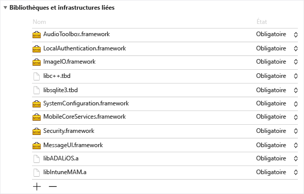
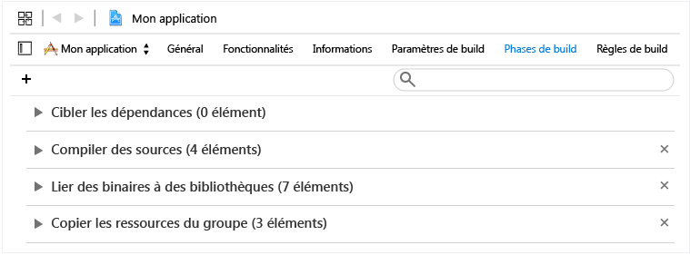
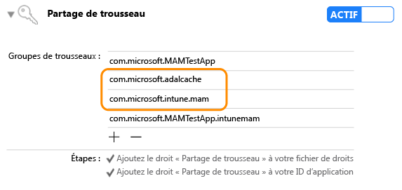

---
# required metadata

title: Guide du Kit de développement logiciel (SDK) d’application Microsoft Intune pour les développeurs iOS | Microsoft Intune
description:
keywords:
author: Msmbaldwin
manager: jeffgilb
ms.date: 04/28/2016
ms.topic: article
ms.prod:
ms.service: microsoft-intune
ms.technology:
ms.assetid: 8e280d23-2a25-4a84-9bcb-210b30c63c0b

# optional metadata

#ROBOTS:
#audience:
#ms.devlang:
ms.reviewer: jeffgilb
ms.suite: ems
#ms.tgt_pltfrm:
#ms.custom:

---

# Guide du Kit de développement logiciel (SDK) des applications Microsoft Intune pour les développeurs iOS

> [!NOTE] Vous pouvez d’abord consulter le [Guide de prise en main du Kit de développement logiciel (SDK) d’application Intune](intune-app-sdk-get-started.md), qui explique comment préparer l’intégration sur chaque plateforme prise en charge.* 

Le Kit de développement logiciel (SDK) des applications Microsoft Intune pour iOS vous permet d’incorporer la gestion des applications mobiles Intune à votre application iOS. Une application de gestion des applications mobiles est une application intégrée au SDK des applications Intune. Elle permet aux administrateurs informatiques de déployer des stratégies sur votre application mobile quand l’application est gérée activement.

# Contenu du Kit de développement logiciel (SDK)

Le SDK des applications Intune pour iOS inclut une bibliothèque statique, des fichiers de ressources, des en-têtes d’API, un fichier plist de paramètres de débogage et un outil de configuration. Les applications mobiles peuvent simplement inclure les fichiers de ressources et être liées aux bibliothèques de manière statique pour l’application de la plupart des stratégies. Les fonctionnalités de gestion des applications mobiles Intune avancées sont appliquées par le biais d’API.
Ce guide couvre l’utilisation de ce qui suit lors de l’intégration du SDK des applications Intune pour iOS :

* **`libIntuneMAM.a`** : bibliothèque du SDK des applications Intune. Liez cette bibliothèque à votre projet pour rendre votre application mobile compatible avec la gestion des applications mobiles. Des instructions sont données ici dans la section « Génération de votre application avec le SDK des applications Intune ».

* **`IntuneMAMResources.Bundle`** : groupe de ressources qui contient les ressources sur lesquelles repose le SDK. 

* **En-têtes**: expose les API du SDK des applications Intune. Si vous utilisez une API, vous devez inclure le fichier d’en-tête contenant l’API. 

# Fonctionnement du SDK des applications Intune

L’objectif du SDK des applications Intune pour iOS consiste à ajouter des fonctionnalités de gestion aux applications iOS par le biais de modifications minimales du code. Réduire la quantité de modifications de code permet d’accélérer la commercialisation, tout en améliorant la cohérence et la stabilité de votre application mobile. 

L’application doit être liée à la bibliothèque statique et inclure le groupe de ressources. Le fichier MAMDebugSettings.plist est facultatif et peut être inclus dans le package pour simuler des stratégies de gestion des applications mobiles appliquées à l’application sans avoir à déployer l’application par le biais de Microsoft Intune. De plus, dans les versions de débogage, les stratégies incluses dans le fichier MAMDebugSettings.plist sont appliquées en transférant le fichier MAMDebugSettings.plist vers le répertoire Documents de l’application par le biais du partage de fichiers iTunes.

# Génération de votre application avec le Kit de développement logiciel (SDK) des applications Intune 

Suivez les étapes ci-dessous pour activer le SDK des applications Intune :

1. Établissez un lien vers la bibliothèque `libIntuneMAM.a` en procédant comme suit :

    Glissez-déplacez la bibliothèque libIntuneMAM.a vers la liste « Infrastructures et bibliothèques liées » de la cible du projet.  

    
 
    **Remarque**: lors de la publication dans la boutique d’applications, utilisez la version de libIntuneMAM.a générée pour la version finale et non la version de débogage. La version finale se trouve dans le dossier « release ». La version de débogage comporte une sortie détaillée qui convient au débogage des problèmes rencontrés avec le SDK des applications Intune.

2. Ajoutez les infrastructures iOS suivantes au projet (si elles sont manquantes).
    * `MessageUI.framework`
    * `Security.framework`
    * `MobileCoreServices.framework`
    * `SystemConfiguration.framework`
    * `libsqlite3.dylib`
    * `libc++.dylib`
    * `ImageIO.framework`
    * `LocalAuthentication.Framework`
    * `AudioToolbox.framework` 

    **Remarque**: si l’application est ciblée pour iOS7, définissez l’attribut « Status » de `LocalAuthentication.Framework` sur « Optional ». 

    Si « Status » n’est pas défini, l’application ne démarre pas sur iOS7.

    **Remarque**: Xcode 7 a remplacé les extensions `.dylib` par `.tbd`.

3. Ajoutez le groupe de ressources `IntuneMAMResources.bundle` au projet en faisant glisser le groupe de ressources sous « Copy Bundle Resources (Copier les ressources de groupe) » dans « Build Phases (Phases de la build) ». 

    

4. Ajoutez `-force_load {PATH_TO_LIB}/libIntuneMAM.a` à l’un des éléments suivants, en remplaçant `{PATH_TO_LIB}` par l’emplacement du SDK des applications Intune :
    * le paramètre de configuration de la build OTHER_LDFLAGS du projet, 
    * les « autres indicateurs de l’éditeur de liens » de l’interface utilisateur. 

    **Remarque**: pour trouver le `PATH_TO_LIB`, sélectionnez le fichier `libIntuneMAM.a` et choisissez « Obtenir les informations » dans le menu « Fichier ». Copiez et collez les informations d’emplacement (le chemin) à partir de la section « Général » de la fenêtre d’information.

5. Si votre application mobile définit un Nib ou Storyboard principal dans son fichier `info.plist`, supprimez les champs du fichier MainStoryboard ou MainNib. Ajoutez les valeurs Storyboard ou Nib que vous avez supprimées précédemment à un nouveau dictionnaire nommé `IntuneMAMSettings` avec les noms de clé suivants, selon le cas :
    * `MainStoryboardFile`
    * `MainStoryboardFile~ipad`
    * `MainNibFile`
    * `MainNibFile~ipad `
    
    Si votre application mobile ne définit pas un Nib ou Storyboard principal dans son fichier `info.plist`, ces paramètres ne sont **pas requis**. 

    **Remarque**: vous pouvez consulter le fichier `info.plist` dans son format brut (pour voir les noms de clé) en cliquant avec le bouton droit n’importe où dans le corps du document et en choisissant le type de vue « Show Raw Keys/Values (Afficher les clés/valeurs brutes) ».

6. Activez le partage de trousseau (s’il ne l’est pas déjà) en cliquant sur « Fonctionnalités » dans chaque cible du projet et en activant le commutateur Partage de trousseau. Le partage de trousseau est requis pour passer à l’étape suivante.

    **Remarque**: votre profil de configuration doit prendre en charge de nouvelles valeurs de partage de trousseau. Les groupes de trousseau d’accès doivent prendre en charge un caractère générique. Vous pouvez le vérifier en ouvrant le fichier `.mobileprovision` dans un éditeur de texte, en recherchant « keychain-access-groups » en veillant à avoir un caractère générique, par exemple : 

       <key>keychain-access-groups</key>
       <array>
       <string>YOURBUNDLESEEDID.*</string>
       </array>

7. Après avoir activé le partage de trousseau, procédez comme suit pour créer un groupe d’accès distinct dans lequel les données du SDK des applications Intune seront stockées. Vous pouvez créer un groupe d’accès au trousseau à l’aide de l’interface utilisateur ou du fichier des droits :

    Utilisation de l’interface utilisateur pour créer un groupe d’accès au trousseau : 
    
    * Si votre application mobile n’a pas de groupes d’accès au trousseau définis, ajoutez l’ID d’offre groupée de l’application en tant que premier groupe.
    * Ajoutez le groupe de trousseau partagé com.microsoft.intune.mam. Ce groupe d’accès est utilisé par le SDK des applications Intune pour stocker des données.  
    * Ajoutez le groupe de ressources `com.microsoft.adalcache` à vos groupes d’accès existants. 
 
    

    Si vous utilisez le fichier des droits pour créer le groupe d’accès au trousseau, plutôt que l’interface utilisateur standard, vous devez ajouter le groupe d’accès au trousseau avec `$(AppIdentifierPrefix)` dans le fichier des droits. Exemple : `$(AppIdentifierPrefix)com.microsoft.intune.mam` et `$(AppIdentifierPrefix)com.microsoft.adalcache`.

    **Remarque**: un fichier des droits est un fichier XML unique propre à votre application mobile qui est utilisée pour spécifier des autorisations et fonctionnalités spéciales au sein de votre application iOS.

8. Pour les applications mobiles développées pour iOS 9+, vous devez inclure chaque protocole que votre application mobile passe à `UIApplication canOpenURL` dans le tableau `LSApplicationQueriesSchemes` du fichier `info.plist` de votre application mobile. De plus, pour chaque protocole répertorié, un nouveau protocole doit être ajouté avec `-intunemam`. Vous devez également inclure `http-intunemam`, `https-intunemam`et `ms-outlook-intunemam` dans le tableau. 

9. Si l’application définit des modèles d’URL dans son `info.plist file`, ajoutez un autre modèle, avec un suffixe `-intunemam` , pour chaque modèle d’URL.

10. Si l’application possède des groupes d’applications définis dans ses droits, ajoutez ces groupes au dictionnaire `IntuneMAMSettings` sous la clé `AppGroupIdentitifiers` sous la forme d’un tableau de chaînes.

11. Liez votre application mobile à la bibliothèque ADAL. La bibliothèque ADAL pour Objective C est [disponible sur Github](https://github.com/AzureAD/azure-activedirectory-library-for-objc).

    **Remarque**: le SDK des applications Intune a été testé par rapport au code ADAL Broker Branch du 19/06/2015. Assurez-vous d’établir un lien avec la version la plus récente/fonctionnelle de la bibliothèque ADAL.

12. Incluez le groupe de ressources `ADALiOSBundle.bundle resource` dans le projet en faisant glisser le groupe de ressources sous « Copy Bundle Resources (Copier les ressources de groupe) » dans « Build Phases (Phases de la build) ».

13. Utilisez l’option de l’éditeur de liens `-force_load PATH_TO_ADAL_LIBRARY` pour établir le lien avec la bibliothèque.

    Ajoutez `-force_load {PATH_TO_LIB}/libADALiOS.a` au paramètre de configuration de la build OTHER_LDFLAGS du projet ou les « autres indicateurs de l’éditeur de liens » dans l’interface utilisateur. Vous devez remplacer « PATH_TO_LIB » par l’emplacement des binaires ADAL. 

Si votre application mobile utilise la bibliothèque ADAL pour sa propre authentification, consultez la section « Configuration des paramètres de la bibliothèque d’authentification Azure Directory » située ici.

## Télémétrie 

Le SDK des applications Intune pour iOS consigne des données télémétriques sur les événements d’utilisation par défaut, lesquelles sont envoyées à Microsoft Intune.

Des données sont journalisées pour les événements d’utilisation suivants : 

1. Lancement d’applications pour aider Microsoft Intune à en savoir plus sur l’utilisation d’applications compatibles avec la gestion des applications mobiles par type de gestion.

2. Appel d’API EnrollApplication pour aider Microsoft Intune à en savoir plus sur les taux de réussite et diverses autres mesures de performances de l’appel d’EnrollApplication côté client.

**Remarque**: si vous choisissez de ne pas envoyer les données télémétriques du SDK des applications Intune à Microsoft Intune depuis votre application mobile, vous **devez désactiver** la capture de la télémétrie du SDK en affectant à la propriété `MAMTelemetryDisabled` la valeur « YES » dans `IntuneMAMSettings`.

## Configuration des paramètres de la bibliothèque d’authentification Azure Directory (ADAL) (facultatif)

Le Kit de développement logiciel (SDK) des applications Intune utilise la bibliothèque ADAL pour son authentification et le scénario de lancement conditionnel. En règle générale, la bibliothèque ADAL requiert que les applications s’inscrivent et obtiennent un ID unique, appelé `ClientID`, et d’autres identificateurs, pour garantir la sécurité des jetons octroyés à l’application. Le SDK des applications Intune utilise les valeurs d’inscription par défaut pour contacter Azure Active Directory.  Si l’application elle-même utilise la bibliothèque ADAL pour son scénario d’authentification, l’application doit utiliser ses valeurs d’inscription existantes et remplacer la valeur par défaut du SDK des applications Intune pour veiller à ce que les utilisateurs finaux ne soient pas invités à s’authentifier deux fois (une fois auprès du SDK des applications Intune et une fois auprès de l’application). 

Les étapes ci-dessous sont requises si l’application elle-même utilise la bibliothèque ADAL pour l’authentification. Si votre application mobile ne compte pas sur la bibliothèque ADAL, aucune action supplémentaire n’est requise. 

1. Dans le fichier `Info.plist`du projet, sous un dictionnaire `IntuneMAMSettings` portant le nom de clé `ADALClientId`, indiquez que la valeur `ClientID` doit être utilisée pour les appels de la bibliothèque ADAL. 

2. Dans le fichier `Info.plist`du projet, sous le dictionnaire `IntuneMAMSettings` portant le nom de clé `ADALRedirectUri`, indiquez que l’URI de redirection à utiliser pour les appels de la bibliothèque ADAL. Vous pouvez également spécifier `ADALRedirectScheme` selon le format de l’URI de redirection de votre application.

## Génération de vos extensions (facultatif) 

Quand vous générez des extensions, suivez les mêmes instructions pour générer votre application mobile comme indiqué dans la section « Génération de votre application avec le SDK des applications Intune » située ici. De plus, mettez à jour le fichier info.plist de chaque extension pour ajouter une clé ContainingAppBundleId dans le dictionnaire IntuneMAMSettings avec la valeur de l’id d’offre groupée de l’application conteneur.

## Génération de vos infrastructures (facultatif)

Avec les dernières modifications apportées au SDK des applications Intune, vous n’avez pas à compiler votre application mobile avec des indicateurs de l’éditeur de liens spécifiques si votre application mobile contient des infrastructures d’applications incorporées. 

## Fichiers image au démarrage (facultatif)

Quand une application compatible avec la gestion des applications mobiles est activement gérée par Microsoft Intune, le SDK des applications Intune affiche un écran de démarrage au lancement des applications pour indiquer à l’utilisateur que l’application est gérée. Vous pouvez éventuellement ajouter des fichiers image à afficher sur la page de démarrage « Géré par votre entreprise ». Pour les images, respectez les instructions suivantes :

* Ajoutez les noms de fichiers sous le dictionnaire `IntuneMAMSettings` dans le fichier info.plist de l’application avec les noms de clé `SplashIconFile` et `SplashIconFile~ipad`. 

* Configuration requise et taille de l’image :

    * 180 x 180 pour iPhone 6s Plus et iPhone 6 Plus, 120 x 120 pour les autres modèles iPhone et 152 x 152 pour iPad. 
    
    * Supprimez l’extension `.png` des noms de fichiers. 
    
    * Utilisez l’option de l’éditeur de liens `@2x` pour les versions de mise à l’échelle 2x et le suffixe `@3x` pour les versions de mise à l’échelle 3x des fichiers image. Si les images ne sont pas à la bonne taille, elles sont ajustées. Si les valeurs SplashIconFile ne sont pas spécifiées, le SDK des applications Intune sélectionne l’une des icônes de l’application (60 x 60 pour tous les iPhone, 76 x 76 pour iPad).

**Remarque**: cet écran est déclenché au lancement, mais il peut être désactivé définitivement par l’utilisateur.

# Configurer les paramètres du SDK des applications Intune

Le dictionnaire `IntuneMAMSettings` contenu dans le fichier `info.plist` de l’application sert à configurer le SDK des applications Intune. Voici la liste de tous les paramètres pris en charge. 

Certains de ces paramètres ont peut être été traités dans les sections précédentes et d’autres ne s’appliquent pas à toutes les applications. 

Paramètre  | Type  | Définition | Nécessaire ?
--|--|--|--
ADALClientId  | Chaîne  | Identificateur du client AAD de l’application. | Obligatoire si l’application a utilisé la bibliothèque ADAL.
ADALRedirectUri  | Chaîne  | URI de redirection AAD de l’application. | Obligatoire si l’application a utilisé la bibliothèque ADAL. 
AppGroupIdentifier | Tableau de chaînes  | Tableau de groupes d’applications issu de la section com.apple.security.application-groups des droits de l’application. | Obligatoire si l’application utilise des groupes d’applications.
ContainingAppBundleId  | Chaîne | Spécifie que l’ID d’offre groupée de l’application conteneur de l’extension. | Obligatoire pour les extensions iOS.
MainNibFile MainNibFile~ipad  | Chaîne  | Ce paramètre doit contenir le nom de fichier nib principal de l’application.  | Obligatoire si l’application définit MainNibFile dans son fichier info.plist.
MainStoryboardFile MainStoryboardFile~ipad  | Chaîne  | Ce paramètre doit contenir le nom de fichier storyboard principal de l’application. | Obligatoire si l’application définit UIMainStoryboardFile dans son fichier info.plist.
SplashIconFile  SplashIconFile~ipad  | Chaîne  | Spécifie le fichier d’icône de démarrage Intune. Consultez la section « Fichiers image au démarrage » ici pour plus d’informations. | Facultatif.
SplashDuration | Nombre | Durée minimale en secondes d’affichage de l’écran de démarrage Intune au lancement de l’application. La valeur par défaut est 1,5. | Facultatif.
ADALLogOverrideDisabled | Booléen  | Indique si le Kit de développement logiciel (SDK) achemine tous les journaux de la bibliothèque ADAL (y compris les appels de la bibliothèque ADAL depuis l’application le cas échéant) dans son propre fichier journal. La valeur par défaut est NON. Affectez la valeur OUI si l’application doit définir le rappel de son propre journal ADAL. | Facultatif.

# En-têtes du SDK des applications Intune 

Les en-têtes suivants incluent les appels de fonction API requis pour activer la fonctionnalité du SDK des applications Intune. 

    IntuneMAMAsyncResult.h
    IntuneMAMDataProtectionInfo.h
    IntuneMAMDataProtectionManager.h
    IntuneMAMFileProtectionInfo.h
    IntuneMAMFileProtectionManager.h
    IntuneMAMPolicyDelegate.h
    IntuneMAMLogger.h

# Débogage du Kit de développement logiciel (SDK) des applications Intune dans Xcode

Avant de tester votre application compatible avec la gestion des applications mobiles à l’aide de Microsoft Intune, vous pouvez utiliser `Settings.bundle` dans Xcode. Ainsi, vous pouvez définir des stratégies de test sans requérir de connexion à Intune. Pour l’activer :

* Ajoutez un `Settings.bundle` en cliquant avec le bouton droit sur le dossier de niveau supérieur dans votre projet. Sélectionnez « Ajouter -> Nouveau fichier » dans le menu. Sélectionnez le modèle « Groupe de paramètres » à ajouter sous « Ressources ».

* Sur les versions de débogage uniquement, copiez le fichier `MAMDebugSettings.plist` dans `Settings.bundle`.

* Dans `Root.plist` (dans Settings.bundle), ajoutez une préférence du volet enfant « Type », « FileName » `MAMDebugSettings`.

* Dans « Paramètres -> Nom_de_votre_application », cliquez sur le bouton bascule « Activer les stratégies de test ».

* Lancez l’application (soit dans, soit en dehors de Xcode). 

* Dans « Paramètres -> Nom_de_votre_application -> Activer les stratégies de test », activez/désactivez une stratégie, comme « PIN ».

* Lancez l’application (soit dans, soit en dehors de Xcode). Vérifiez que PIN fonctionne comme prévu.

> [!NOTE] Vous pouvez maintenant utiliser « Paramètres -> nom_de_votre_application -> Activer les stratégies de test » pour activer et désactiver des paramètres.

# Pratiques recommandées pour iOS

Voici quelques pratiques recommandées dans le cadre du développement pour iOS :

Le système de fichiers iOS respecte la casse. Vérifiez que la casse est correcte dans les noms de fichiers comme `libIntuneMAM.a` et `IntuneMAMResources.bundle`.

Si Xcode a des difficultés à trouver `libIntuneMAM.a`, vous pouvez résoudre ce problème en ajoutant le chemin à cette bibliothèque dans les chemins de recherche de l’éditeur de liens.

<!--HONumber=Jun16_HO1-->

