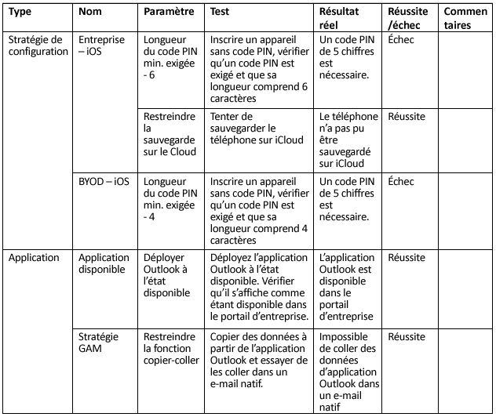
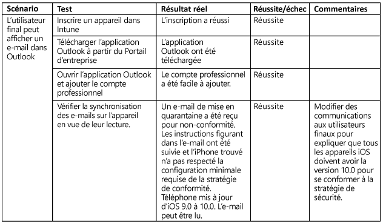

# Test et validation Intune

[!INCLUDE[note for both-portals](../includes/note-for-both-portals.md)]

La phase de test doit avoir lieu pendant et après la phase d’implémentation, et vous devez disposer de comptes, de groupes et d'appareils de test nécessaires pour tester tous les scénarios informatiques (admin) utilisateur final (cas d’utilisation) identifiés précédemment.

Il est recommandé d’impliquer votre personnel de support/assistance informatique dans la phase de test afin de créer la documentation de support et de permettre au personnel de se familiariser avec le produit. Si un composant ou scénario ne fonctionne pas selon les cas d’utilisation, veillez à documenter les modifications nécessaires et à inclure la raison pour laquelle une modification a été apportée.

## Avant de commencer

Il est recommandé de documenter les éléments suivants :

-   **Critères de test :** identifie les bancs d’essai pour réaliser les mesures.

-   **Composants de conception :** doivent exister dans au moins 1 des critères de test.

Si un composant de conception n’existe pas dans au moins 1 des critères de test en fonction d'une spécification ou d’un scénario, déterminez si ce composant de conception est nécessaire ou non. En outre, assurez-vous de disposer des éléments suivants :

-   **Comptes :** les comptes utilisés pour les tests doivent être des comptes de test concédés sous licence pour EMS et Office 365 afin de tester tous les cas d'utilisation.

-   **Appareils :** les appareils utilisés à ce stade doivent être des appareils de test potentiellement effacés ou réinitialisés aux paramètres par défaut.

-   **Composants d’intégration :** tous les composants d’intégration (Certificate Connector, connecteur service à service Intune pour Exchange hébergé et connecteur Intune Exchange local) doivent être installés et configurés, si nécessaire.

Des modifications de conception peuvent être nécessaires pour prendre en compte les problèmes imprévus. En outre, toutes les modifications de conception doivent être entièrement documentées en justifiant chaque changement. Voici un exemple de modification :

-   Vous réalisez que vous ne répondez pas aux exigences du Service d'inscription de périphériques réseau (NDES) et avez également découvert que les profils VPN et Wi-Fi peuvent être configurés avec une autorité de certification racine qui répond aux mêmes exigences sans nécessiter d'implémentation NDES.

Vous rencontrez des difficultés qui requièrent des conseils techniques ou un dépannage spécialisé pendant le processus de test et de validation. Il est recommandé de demander de l’aide via les canaux de support Microsoft.

-   [Découvrir comment obtenir du support Intune](https://docs.microsoft.com/intune/troubleshoot/how-to-get-support-for-microsoft-intune)

-   [Conseils généraux de dépannage pour Microsoft Intune](https://docs.microsoft.com/intune/troubleshoot/general-troubleshooting-tips-for-microsoft-intune).

-   [Découvrir comment obtenir un support technique pour Microsoft Intune.](https://docs.microsoft.com/intune/troubleshoot/how-to-get-support-for-microsoft-intune)

-   [Contacter le support par téléphone pour Microsoft Intune](https://docs.microsoft.com/intune/troubleshoot/contact-assisted-phone-support-for-microsoft-intune)

## Test de validation fonctionnel

La validation fonctionnelle consiste à tester chaque composant et configuration pour vérifier son fonctionnement. Vous trouverez un exemple de test de validation dans le tableau ci-dessous.

## Test de validation de cas d'utilisation

Un test de validation de cas d'utilisation doit être effectué pour vérifier que les scénarios sont complets et fonctionnels. Il existe deux types de scénarios, administrateur informatique et utilisateur final.

### IT Admin

Un test de validation administrateur informatique doit être effectué pour vérifier que l'action administrative effectuée sur un appareil ou utilisateur fonctionne correctement. Voici un exemple de scénario de validation administrateur informatique de bout en bout.

### Utilisateur final

Un test de validation utilisateur final doit être effectué pour vérifier que l’expérience de l'utilisateur final se déroule et se présente comme prévu dans toutes les communications de l’utilisateur. Il est important de vérifier que l'expérience de l’utilisateur final se déroule correctement car tout échec de cette validation risque de réduire les taux d’adoption et entraîner un plus grand volume d’appels au support technique.

## Étapes suivantes

Maintenant que vous avez testé et validé vos scénarios de cas d'utilisation fonctionnels et utilisateur, vous êtes prêt pour le déploiement de production Intune. Pour plus d'informations, reportez-vous à [Ressources supplémentaires](additional-resources.md).

<!--HONumber=Dec16_HO5-->

