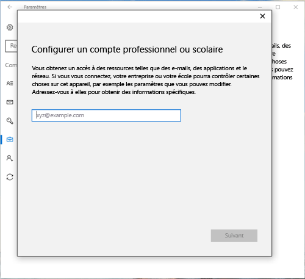
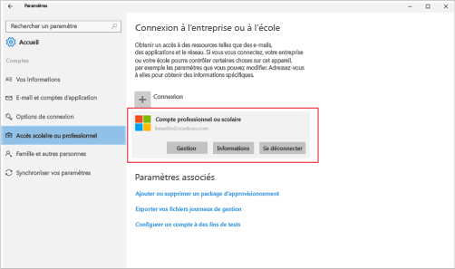

# Inscrire votre appareil Windows 10 dans Intune

<iframe src="https://channel9.msdn.com/Series/IntuneEnrollment/Windows-Enrollment-with-AAD/player" width="960" height="540" allowFullScreen frameBorder="0"></iframe>

1.  Pour ouvrir l’application **Paramètres** Windows, accédez au menu **Démarrer**, puis sélectionnez le bouton **Paramètres**. Vous pouvez également rechercher « paramètres » dans la barre de recherche.

2. Sélectionnez **Comptes** > **Accès Professionnel ou Scolaire** > **Se connecter**.

    

3.  Entrez votre e-mail professionnel ou scolaire, puis sélectionnez **Suivant**.

    

4. Connectez-vous à Intune avec votre compte professionnel ou scolaire.

    

    Vous verrez un message indiquant que votre société ou votre école procède à l’inscription de votre appareil.

5. Lorsque l’écran **Vous voilà prêt !** s’affiche, sélectionnez **Fermer**. Vous avez terminé.

  

6. Si vous voulez vérifier que votre connexion est correcte, revenez aux **Paramètres**, où votre compte professionnel ou scolaire doit maintenant s’afficher.

    

Si vous avez suivi les étapes précédentes, mais que vous ne pouvez toujours pas accéder à votre compte e-mail ou vos fichiers professionnels ou scolaires, consultez les [Étapes de dépannage à suivre si vous voyez Accès scolaire ou professionnel](troubleshoot-your-windows-10-device-windows.md#troubleshooting-steps-to-follow-if-you-see-access-work-or-school).

