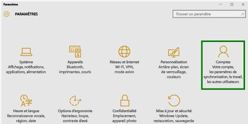

# Inscrire votre appareil Windows 10 dans Intune

  > [!NOTE]
  > Windows 10 fonctionne sur tous les types d’appareils. Si vous utilisez un poste de travail, un téléphone ou une tablette, les étapes à suivre sont les mêmes, même si elles diffèrent légèrement des images de cette page.

1.  Accédez à **Démarrer**.

  - Si vous utilisez un **poste de travail Windows 10**, accédez au **menu Démarrer**.
  - Si vous utilisez un appareil **Windows 10 Mobile**, accédez à l’**écran d’accueil** et balayez pour afficher la liste **Toutes les applications**.

2. Ouvrez l’application **Paramètres** Windows en recherchant « paramètres » dans la barre de recherche.

3. Sélectionnez **Comptes**.

    

4. Sélectionnez **Votre compte**.

    

5. Sélectionnez **Ajouter un compte professionnel ou scolaire**.

    

6. Connectez-vous avec vos informations d'identification professionnelles ou scolaires.

    

Vous ne parvenez toujours pas à accéder à votre messagerie professionnelle ou scolaire, à vos fichiers ou à d’autres données ? Essayez d’y remédier en [résolvant les problèmes liés à votre compte](troubleshoot-your-windows-10-device-windows.md#troubleshooting-steps-to-follow-if-you-see-your-account). Si cela ne fonctionne toujours pas, vous devez contacter votre administrateur informatique pour obtenir de l’aide.

Pour obtenir de l’aide auprès de votre administrateur informatique, il vous suffit d’utiliser les informations de contact disponibles dans l’application Portail d’entreprise, laquelle vous permet également de rechercher et de télécharger les applications recommandées et obligatoires pour votre travail de tous les jours. L’application Portail d’entreprise est peut-être déjà installée sur votre appareil. Pour le vérifier rapidement, recherchez __Portail d’entreprise__ dans votre liste __Toutes les applications__.

Si l'application Portail d'entreprise ne figure pas dans votre liste d'applications, procédez comme suit pour l'installer.

1. Sélectionnez **Démarrer** > **Magasin**.

2. Sélectionnez **Rechercher**, puis tapez **portail d’entreprise**.

3. Dans la liste des résultats, sélectionnez **Portail d’entreprise** > **Installer**.

4. Sélectionnez **Installer** ou **Gratuit**. Il n’existe aucune différence entre ces deux options pour vous. Le choix proposé dépend de la façon dont votre organisation a configuré l’application Portail d’entreprise.

