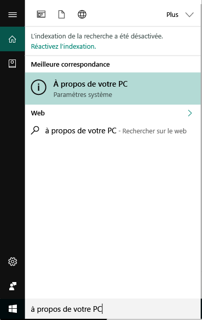
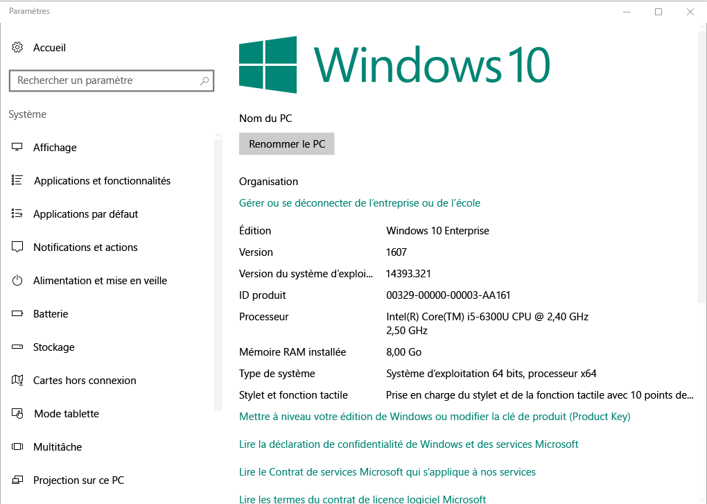

# Inscrire vos appareils Windows 10 dans Intune

L’inscription de vos appareils à Microsoft Intune permet à vos appareils Windows 10 d’avoir accès aux données sécurisées de votre organisation, comme les e-mails, les fichiers et d’autres ressources. Sont à la fois concernés les appareils Windows 10 Desktop et Windows 10 Mobile. L’inscription de vos appareils permet de sécuriser cet accès pour vous et votre organisation. Elle vous permet de séparer vos données professionnelles de vos données personnelles.

Vous voulez en savoir plus ? Découvrez ce qui se passe quand vous [inscrivez votre appareil dans Intune](what-happens-if-you-install-the-company-portal-app-and-enroll-your-device-in-intune-windows.md) et ce que cela signifie pour les [informations contenues dans votre appareil](what-info-can-your-company-see-when-you-enroll-your-device-in-intune.md).

## Appareils Windows 10 Desktop

1. Accédez à **Démarrer**.

2. Tapez les mots « à propos de votre PC » dans la __barre de recherche__, puis sélectionnez __À propos de votre PC__.

 

3.  Dans vos __Paramètres__, la liste des informations sur la version de Windows 10 qui est installée sur votre PC s’affiche. Dans cette liste, repérez la __Version__.

 

4.  Si votre version est __1607 ou supérieure__, suivez [ces étapes](enroll-your-w10-device-access-work-or-school.md). Si votre version est __1511 ou inférieure__, poursuivez avec [ces étapes](enroll-your-w10-device-your-account.md).

## Appareils Windows 10 Mobile        

1.  Dans __Démarrer__, accédez à la liste __Toutes les applications__, puis sélectionnez l’application __Paramètres__.        
2.  Appuyez sur __Système__, puis sur __À propos de__.       
3.  Sous __Informations sur l’appareil__, appuyez sur __Plus d’infos__. La liste des informations sur votre appareil s’affiche. Dans cette liste, repérez la __Version__.        
4.  Si votre version est __1607__, poursuivez avec [ces étapes](enroll-your-w10-device-access-work-or-school.md). Si votre version est __1511 ou inférieure__, poursuivez avec [ces étapes](enroll-your-w10-device-your-account.md).

Encore besoin d’aide ? Contactez le support technique de votre entreprise. Pour obtenir ses informations de contact, consultez le [site web du Portail d’entreprise](https://portal.manage.microsoft.com).
