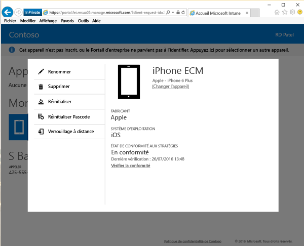

# Verrouiller à distance un appareil à partir du site web du portail d’entreprise

Des accidents se produisent et des appareils peuvent parfois disparaître. Si votre appareil a été perdu ou volé, vous devez d’abord vous demander si les informations qu’il contient sont accessibles à n’importe qui, quel que soit l’endroit où se trouve votre appareil.

[!INCLUDE[wit_nextref](includes/end-user-password-guidance.md)]

Pour plus de sécurité, vous pouvez le verrouiller en utilisant l’option Verrouillage à distance sur le [site web du portail d’entreprise](http://portal.manage.microsoft.com). L’option Verrouillage à distance fonctionne pour :

* Android
* iOS
* macOS
* Windows 10 Mobile (si un code secret avait déjà été défini sur l’appareil)
* Windows Phone 8.1 (si un code secret avait déjà été défini sur l’appareil)

## Pour utiliser l’option Verrouillage à distance pour verrouiller votre appareil

1.    Sur le [site web Portail d’entreprise](http://portal.manage.microsoft.com), cliquez sur le bouton de __menu__ , puis sélectionnez __Mes appareils__.

  

2. Dans la page __Mes appareils__, sélectionnez le nom de l’appareil à verrouiller.

  

3.    L’appareil s’ouvre dans une fenêtre contextuelle. Appuyez sur le bouton **Verrouillage à distance**.

    

4.    Une notification s’affiche pour vous informer que vous êtes sur le point de verrouiller votre appareil. Appuyez sur **Verrouillage à distance** et le site web du portail d’entreprise tente de verrouiller votre appareil.

    Une fois que vous avez sélectionné **Verrouillage à distance**, le message « Verrouillage à distance en attente » s’affiche.  Si le verrouillage à distance aboutit, l’état passe à « Verrouillage à distance réussi ».

    L’état Verrouillage à distance s’affiche à trois emplacements :

    * La zone de notification du site web.
    * La page **Détails** de l’appareil.
    * La vignette qui affiche le nom de l’appareil dans la section **Mes appareils** de la page.

> [!Note]
> Si vous voyez une notification « Échec du verrouillage à distance », attendez quelques minutes et essayez à nouveau de verrouiller votre appareil. Dès le début de la nouvelle tentative, l’état passe à « Verrouillage à distance en attente ». Si la nouvelle tentative ne fonctionne pas, vous devez contacter votre administrateur informatique.

Si vous retrouvez votre appareil et que vous souhaitez le déverrouiller après avoir utilisé le verrouillage à distance, il vous suffit d’entrer votre code secret.

Encore besoin d’aide ? Contactez votre administrateur informatique. Pour obtenir ses coordonnées, consultez le [site web du Portail d’entreprise](http://portal.manage.microsoft.com).

