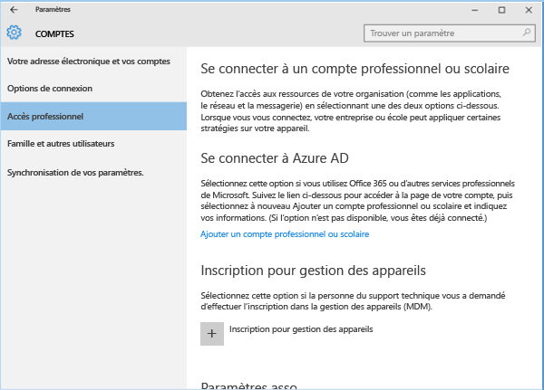
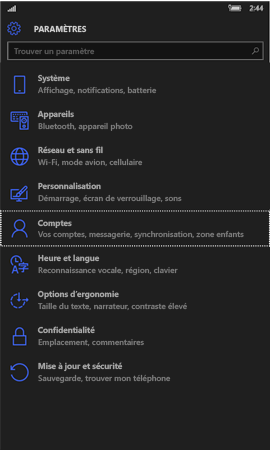
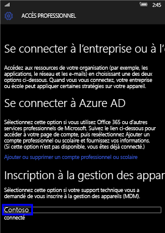
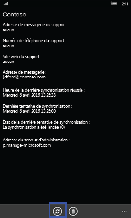
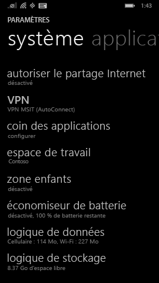
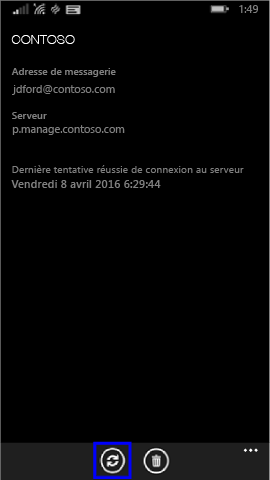

# Synchroniser votre appareil Windows manuellement

Quand la vitesse d’installation des applications est loin d’être idéale, lancez une synchronisation manuelle de l’appareil. Les synchronisations manuelles forcent votre appareil à se connecter à Intune pour obtenir les dernières mises à jour et communications. La vitesse d’installation peut augmenter une fois la synchronisation de l’appareil terminée.

Intune prend en charge la synchronisation manuelle à partir de l’application Portail d’entreprise et de l’application Paramètres de l’appareil. 

La fonctionnalité de l’application Portail d’entreprise est prise en charge sur les appareils Windows 10 exécutant Creators Update (1703) ou version ultérieure. 
* [Synchroniser à partir de l’application Portail d’entreprise](#Sync-from-Company-Portal-app-for-Windows)  

Tous les appareils Windows peuvent être synchronisés à partir de l’application Paramètres de l’appareil, notamment :

* [Windows 10 Desktop](#windows-10-desktop)  
* [Microsoft HoloLens](#microsoft-hololens)   
* [Windows 10 Mobile](#windows-10-mobile)  
* [Windows Phone 8.1](#windows-phone-81)    

## Synchroniser à partir de l’application Portail d’entreprise pour Windows
Effectuez les étapes suivantes pour synchroniser manuellement n’importe quel appareil Windows 10 exécutant Creators Update (1703) ou version ultérieure.

1.  Ouvrez l'application Portail d'entreprise sur votre appareil.

2.  Sélectionnez **Paramètres** > **Synchroniser**.

      
    
        

## Synchroniser à partir de l’application Paramètres 
Effectuez ces étapes pour synchroniser manuellement vos appareils Microsoft HoloLens, Windows 10 Desktop, Windows 10 Mobile ou Windows Phone 8.1 à partir de l’application Paramètres.

### Windows 10 Desktop
1. Sur votre appareil, sélectionnez **Démarrer** > **Paramètres**.

2. Sélectionnez **Comptes**.

      

3. Il existe plusieurs versions de Windows 10 pour les ordinateurs de bureau. Comparez votre écran aux captures d’écran ci-dessous pour déterminer l’ensemble des étapes à suivre. 

    * Si votre écran indique **Accès professionnel ou scolaire**, passez aux étapes décrites dans [Accès professionnel ou scolaire](#access-work-or-school).

      

    * Si votre écran indique **Accès professionnel**, passez aux étapes décrites dans [Accès professionnel](#work-access).  

    

#### Étapes pour l’accès professionnel ou scolaire

1. Cliquez sur **Accès professionnel ou scolaire**.

      

2. Sélectionnez le compte en regard duquel figure une icône de porte-documents. Si vous ne voyez pas ce compte, votre entreprise a peut-être configuré vos paramètres d’une autre manière. Dans ce cas, cliquez sur le compte en regard duquel figure un logo Microsoft.

     

3. Cliquez sur **Informations**. 

4. Cliquez sur **Synchroniser**. 

#### Étapes pour l’accès professionnel

1.  Cliquez sur **Accès professionnel**.

    

2. Sous **Inscription à la gestion des appareils**, sélectionnez le nom de votre société.

    

3. Cliquez sur **Synchroniser**. Le bouton reste désactivé tant que la synchronisation n’est pas terminée.

      

### Windows 10 Mobile

   1. Sur votre appareil, accédez à **Toutes les applications** > **Paramètres** > **Comptes**.

       

   2. Sélectionnez **Accès professionnel**.

       

   3. Sous **Inscription à la gestion des appareils**, sélectionnez le nom de votre société.

       

   4. Sélectionnez l’icône **Synchroniser**. Le bouton reste désactivé tant que la synchronisation n’est pas terminée.

         
### Microsoft HoloLens  
Ces instructions s’appliquent aux appareils HoloLens exécutant la Mise à jour anniversaire Windows 10 (également appelée RS1). 
1.  Ouvrez l’application Paramètres sur votre appareil.  

2.  Sélectionnez **Comptes** > **Accès professionnel**.  
      

3.  Sélectionnez votre compte connecté > **Synchroniser**.   

### Windows Phone 8.1

1. Accédez à **Toutes les applications** > **Paramètres** > **espace de travail**.

    

2. Sélectionnez le nom de votre société.

    

3. Sélectionnez l’icône **Synchroniser**.

    

Encore besoin d’aide ? Contactez le support technique de votre entreprise. Pour obtenir ses coordonnées, consultez le [site web du Portail d’entreprise](https://portal.manage.microsoft.com#HelpDeskDialog).
